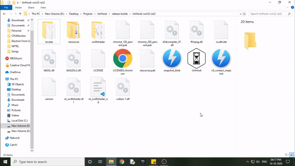

# UnHook

    

<!-- 

    
    
    
    

 -->

  

If you are one of the rare breed of people who call themselves programmers, you must have faced the following sitation:

You were so busy working, that you forgot to take a break while coding... now your eyes hurt due to the excessive stress on them.

The solution? Use UnHook, an app that helps you un-hook yourself from the screen by reminding you to take breaks at the right time.

## Demo

    

## Platforms

1. Windows
2. Linux
3. MacOS

## Tools/Frameworks Used

1. Electron
2. React
3. Redux (This is an overkill for such a small app, its used for practicing redux + electron integration)

## How to Use

1. Download and go to the repository location.
2. Install depenencies for main app using `npm run install-dependencies`
3. Perform either of the following based on the development status of the app you are using:
   - **PRODUCTION (default):** Use `npm run build-front-end` to build the react app
   - **DEVELOPMENT:** Use `npm run start-front-end` to start the react app
4. Use `npm run dev` to start the electron app

## Packaging

1. Make sure that `process.env.NODE_ENV` is set to `PRODUCTION` in [main.js](./main.js)
2. Use `npm run build-front-end` to package the react app
3. Use `npm run build-app` to package the app for the current platform

## Note

The app won't run properly in the browser as it is made specifically for desktop using electron
